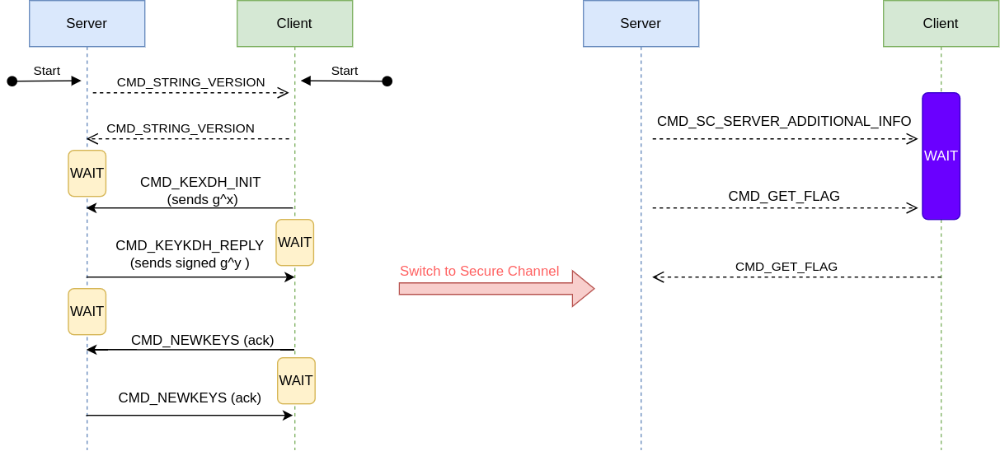
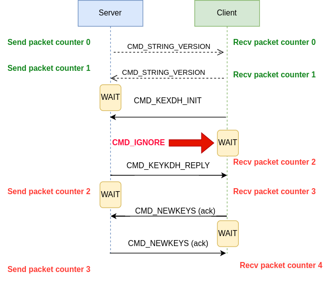
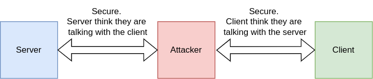
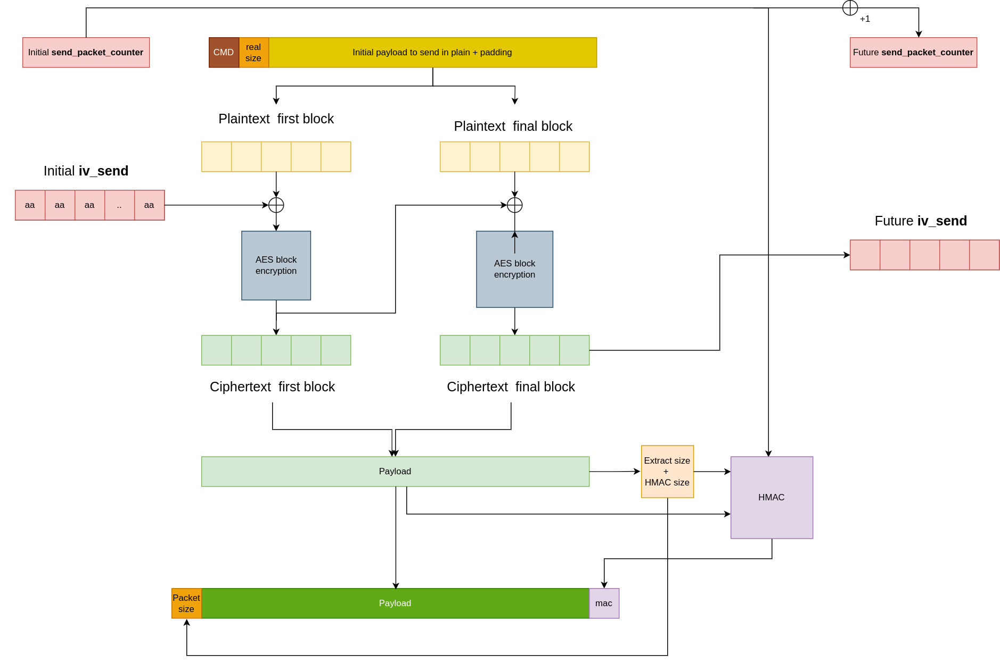
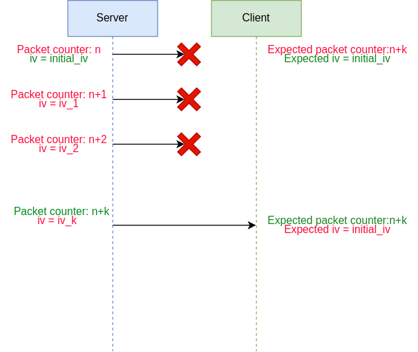
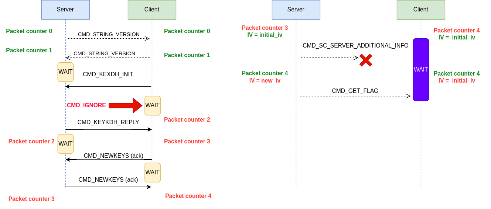

# Table of Contents

1.  [Introduction](#org6876d62)
2.  [Phase 1: Protocol analysis (i.e what the hell is going on)](#org16d8a3f)
3.  [Phase 2: Cryptographic analysis (i.e How did they mess up this time?)](#org58b93e4)
4.  [Phase 3: profit](#org784c579)
5.  [Conclusion](#org6b2ff0e)

# Introduction

This write-up will present a solution for &rsquo;Secret SHenanigans&rsquo;, one of the 12 cryptographic challenges of the France CyberSecurity Challenge (FCSC) 2024.

In this challenge, we are given a network TAP (enabling Men in the Middle capabilities) over a secure communication between a client and a server. The source code of both the client and the server is provided with fake keys, as well as a functional docker image emulating the communication between the client and the server, and the network TAP.

For this challenge we will have to analyse the implemented network protocol and identity weaknesses in both the cryptographic structure and the network protocol.

This challenge was inspired by the terrapin attack, a cryptographic attack in the implementation of the SSH protocol discovered in 2023.

# Phase 1: Protocol analysis (i.e what the hell is going on)

First, let&rsquo;s delve into the source code `client.py` and `server.py.`

Both codes describe a state machine for the client and the server that eventually enables the client to communicate the flag to the server. The client and the server can communicate in secure mode and unsecure mode. They craft a shared private key using the Diffie-Hellman (DH) key exchange and use it to send secure information. The theory behind the DH key exchange will not be analyzed in this write up, as there is no vulnerability in this challenge regarding DH. It is enough to know that this protocol enables secure key exchange over an unsecure network (e.g where someone might be using a network TAP to listen to the traffic).  Without interacting, the exchange will work as follow:

-   Server and Client send a hello message containing the version
-   Client sends a Diffie-Hellman key ($g^x$) to the server
-   Server responds with their part of the key ($g^y$) alongside a signature
-   Both parties acknowledge the key using CMD\_NEWKEYS
-   Both client and server switch to secure channel using the shared private key
-   Server sends information to the client
-   Server asks the client for the flag
-   Client sends the flag

The following sequence diagram summarize the interaction between client and server.

On the left part, client and server exchange synchronization message and DH keys. This part is unencrypted and we can read all these messages and send arbitrary messages using the provided network TAP. The keys are then used to switch to a secure channel. In the secure channel (right part), client and server exchange private information, including the flag. As this part is encrypted, the network TAP can still read the cipher text, but not the corresponding clear messages. It is also impossible to forge messages as we would need to encrypt them first.

\vspace{1cm}

This exchange is a typical state machine for any DH-based protocol, the cryptographic implications will be further analyzed in the next part.

The yellow &ldquo;WAIT&rdquo; blocks are special state machines: In these states, the client/server waits for specific commands. In the meantime, they are still able to process elementary packets such a CMD\_PING packets (to which they reply with CMD\_PONG packets) or CMD\_IGNORE packets (that they simply receive).

The client&rsquo;s purple &ldquo;WAIT&rdquo; block in the secure channel is slightly different. This part is one big state machine where each packet received leads to a corresponding action (namely, a response message is sent, or some value is updated) until the CMD\_GET\_FLAG command is received. The client then responds with our precious flag. It&rsquo;s important to note that the client can only send the flag when it reaches this purple state machine.

Among the commands that can be processed by the client, one of them is &ldquo;CMD\_DISABLE\_SC&rdquo;. This command disables the secure channel for the client, hence all following message would be sent without encryption. Our objective can now be specified: we must somehow trick the server into sending such command (encrypted), then use the TAP network to gently ask the client for the flag in plain text.

\vspace{1cm}

A final detail about this protocol: just like any other respectable packet protocol, it is numbered. Each packet sent or received is associated with a corresponding `recv_packet_counter` or `send_packet_counter`. Every time a packet is sent or received, the client or server will increment their own counters. In secure mode, the packet numbers will be checked to ensure that their sequence number match the expected value.

A first vulnerability can be identified at this point: The packet numbers are only checked in secure mode, not in unsecure mode. During the key exchange in unsecure mode, we can send arbitrary packets to the client and server using our network TAP, including CMD\_IGNORE and CMD\_PING.

-   Sending CMD\_IGNORE would increase the `recv_packet_counter` of the target number by one
-   Sending CMD\_PING and discarding the target&rsquo;s reply &ldquo;CMD\_PONG&rdquo; would increase both the `recv_packet_counter` and `send_packet_counter` of the target by one with no change for the other

Here is situation where we manually add an extra packet (red arrow). Client and server are de-synchronized after this step.

This means that we can make the client and server start the secure connection with arbitrary `recv_packet_counter` and `send_packet_counter`, making some later message invalid or valid sooner than they should.

At this point, the protocol is well understood and our objective is more clear. But, after all, this is a cryptographic challenge.

# Phase 2: Cryptographic analysis (i.e How did they mess up this time?)

These Diffie-Hellman protocol are extremely vulnerable to Men-in-the-Middle attacks. An attacker could intercept both public keys from client and server, enable secure communication with both, then forward/tampered the messages of each party.

However, such attack won&rsquo;t be possible here as the server signs their messages with a public key. Any attempt to forge or tamper messages from the server would require a signature forgery. The client does not sign their message, which mean that we could use this attack to open a secure shell with the server. But since the server does not have the flag, this won&rsquo;t get us anywhere.

From the last file `common.py`, we can see that messages in the secure channel are encrypted using AES-CBC, and a HMAC is derived using the shared key. The following informations are authenticated:

-   Send packet counter
-   The size of the ciphertext + authentication tag
-   The ciphertext

This corresponds to an encrypt-then-mac mode. The following figure represents the full encrypt-and-mac procedure for a given packet send. The full message (top fully colored block) is encrypted and authenticated and then sent as a payload (bottom fully colored block). During this encryption, the `send_packet_counter` is updated alongside the `iv_send`

However, the IV is not included in the HMAC. In fact, it&rsquo;s not even included in the packet. The IV is actually fixed to a constant sequence and updated every time a message is sent / received.

This means that both client and server keep tracks of `iv_sent` (resp. `iv_recv`) in order to encrypt (resp. decrypt) the next message. Since packet numbers are verified, `iv_sent` of the client should corresponds at all time to `iv_recv` of the server, as it&rsquo;s computed using the previously sent message.

When a secure packet is received, the following procedure is followed:

-   Retrieve one byte, indicating the total size of the message to retrieve
-   Retrieve the message and extract the mac
-   Using the shared private key, check that the payload, total size of the message and packet counter are valid
-   Decrypt the payload into the initial message
-   Eventually check the CMD
-   Check that the real size corresponds to the decrypted packet

From a cryptographic perspective, the main weakness in this scheme is that the IV is not included in the MAC. Since the good formatting of the padding is not checked, this means that the `recv` function will not be able to detect changes in the IV.

It is well known that AEC-CBC message are quite malleable (#SSTIC2024). Flipping bits of the IV will make the corresponding bit flips on the first block of the plaintext. As identified during the protocol analysis, all we need to do is to make the server send a CMD\_DISABLE\_SC command, which can be achieved by changing the first byte of the IV.

For the designers, it would not have been an issue because an attacker has no control over the IV. Since the packet counter is included in the MAC, and the packet counter and IV are both updated simultaneously and deterministically, any error in the IV would imply that the packet number would be incorrect.

# Phase 3: profit

As we want to forge a message from the server to the client, for simplicity both the `send_packet_counter` of the server and the `recv_packet_counter` of the client will be named `packet counter`.

As identified in Phase 1, by sending unexpected message during the authentication step, it is possible to de-synchronize the packet counters of the client and the server. While this should automatically lead to an error as soon as the server sends a message in secure channel, we can discard some message of the server until the packet counter are resynchronized. As the server would have updated the IV every time, we would have an IV mismatch between the client and the server. The following figure summarize such strategy

Plugging everything together, we will use the following strategy.

First send a CMD\_IGNORE to the client during one of the key exchange in order to tamper its packet counter.

When initializing secure communication, client will have a packet number of 4 instead of 3. In order to compensate for this difference, the first message of the server will be discarded. Then, the next message sent by the server (CMD\_GET\_FLAG) will have a correct packet number, hence have a valid MAC for the client.

However, as it was encrypted AFTER the discarded message, a different IV will be used for encryption. Even better, the new\_iv can be retrieved as the last AES chunk of the CMD\_SC\_SERVER\_ADDITIONAL\_INFO message.

As we want to change the CMD\_SC\_SERVER\_ADDITIONAL\_INFO (0x8) into CMD\_DISABLE\_SC(0x9), given `initial_iv` (0xaa) we have to wait for a `new_iv` with first byte value 164. When it does, we manually use the network TAP to send the GET\_CMD\_FLAG command (by appending the message in clear to the encrypted version initially sent by the server) unencrypted and retrieve the result.

This should happen in 256 tries. Then we need to have a message size high enough to pass the second check (checking that the size of the message is at least the provided value). There is nothing we can do about this check as it comes from the plaintext and the cipher text can&rsquo;t be changed. But it should not be too long, we just need a byte with value bigger than the initial size (205). It should happen $\frac{256-205}{256}=19\%$ of the times

Well, after a while, we finally get the flag

 <h3>Flag</h3> 
# Table of Contents

FCSC{1c165d89fadceef1e40d037098a531533150ab871d8d2bff3831c836001a6cce}
 

The source code used to retrieve the flag can be found in the appendix

# Conclusion

This challenge was interesting, as it includes both a protocol analysis and a cryptographic analysis, both revealing crucial details about the vulnerability. I was glad to see a challenge exploiting encrypt-then-mac paradigm instead of the unreliable mac-then-encrypt. It taught me a lot about encryption strategies, state machines in cryptography (it also taught me about poor latency in SNCF&rsquo;s high-speed train).

