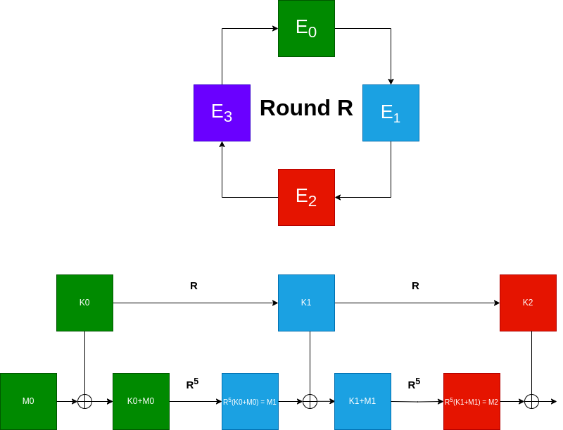

# Table of Contents

1.  [Introduction](#orga1b08af)
2.  [A small linear analysis](#orgd4c5336)
3.  [State of the art (i.e let the professionals do their jobs)](#orge707391)
4.  [Back to our case](#org517fba5)
5.  [Implementation](#org50a1a69)
6.  [Conclusion](#org7e6c8fd)

# Introduction

This write-up contains a solution for &rsquo;Tight Schedule&rsquo;, one of the 12 cryptographic challenges of the France CyberSecurity Challenge (FCSC) 2024.

In this challenge we are given a custom symmetric encryption system. We are also given a pair ciphertext-plaintext, from which we need to retrieve the key in order to get the flag. The encryption system is given as followed:

# A small linear analysis

First, let&rsquo;s ensure that we known what we are dealing with. The source strongly resembles AES: the SBOX and the key schedule function are identical (the round constant at point zero is different, but unused).

However, during encryption, our familiar sub-Bytes, mix-columns and shift-rows are replaced by 5 iterations of the key schedule on the ciphertext, with a constant of zero. This means that we will have to analyse the security of the key schedule of AES. For simplicity, and in order to respect the challenge&rsquo;s notation, we will simply refer to this key schedule as a `round`.

\vspace{0.5cm}

During this write-up, we will work in field $GF(2^8)$, changing all XOR operations into sums.

\vspace{0.5cm}

The following part will not lead to any exploitable vulnerability, but understanding it is good path toward understanding the structure of the round key.

First let&rsquo;s notice some important properties of the round function:

Given an initial state   $K_0 = \[ k_0, k_1,  \vdots,  k_{15} \]$, the output of the round function can be expressed as  $K_1 = M.K_0+ T$
with $T = \[ A, A, A, A \]$ where $A = \[SBOX[k_{13}]+cst,  SBOX[k_{14}], SBOX[k_{15}], SBOX[k_{12}\]$ for a triangular matrice M. We can also observe that $M^4 = Id$

This is interesting because if $T$ is such a vector,

then $M.T = \[ A, 0, A, 0 \]$, $M^2.T = \[A,  A, 0,  0\]$, and $M^3.T = \[ A, 0 , 0,  0 \]$.

Hence, $R^k(K)$ will have the form $M^{k\mod 4}.K+T_{k}$ with $T_k$ a sum of &ldquo;sparse&rdquo; vectors with many zeros. While this operation is not linear, there is a form of periodicity modulo 4 in the matrix. So we might be able to find some stable subset in which this non-linearity can be controlled.

I spent some time there trying to find nice relationships between rounds on paper, with no luck. Then I had access to internet again.

# State of the art (i.e let the professionals do their jobs)

After some research I eventually found this article [New Representations of the AES Key Schedule](https://eprint.iacr.org/2020/1253.pdf), by Gaëtan Leurent and Clara Pernot, in which they studied the existence of invariant spaces of the round function  (among other things).

Starting from the previous analysis. As $M^4=Id$ we can feel that there is some periodicity involved. Looking at affine invariants they found four supplementary affine invariants of dimension 4 for $R^4$, with R the round function.

$$E_0 = \{(a, b, c, d, 0, b, 0, d, a, 0, 0, d, 0, 0, 0, d)\text{ for }a, b, c, d \in GF(2^8)\}$$

$$E_1 = \{(a, b, c, d, a, 0, c, 0, 0, 0, c, d, 0, 0, c, 0)\text{ for }  a, b, c, d \in GF(2^8)\}$$

$$E_2 = \{(a, b, c, d, 0, b, 0, d, 0, b, c, 0, 0, b, 0, 0)\text{ for} a, b, c, d \in GF(2^8)\}$$

$$E_3 = \{(a, b, c, d, a, 0, c, 0, a, b, 0, 0, a, 0, 0, 0)\text{ for } a, b, c, d \in GF(2^8)\}$$

Meaning that for any $u\in GF(2^8)^{16}$, $R^4(u\oplus E_i) = R^4(u)\oplus E_i$.

However, for one round R, the affine subspaces are not invariant but images. We can verify that the following properties hold: $R(u + E_i) = R(u)+E_{(i+1\mod 4)}$ (note that the sum is no longer direct). In the future $i,k$, or any indices for $E$ will be a integer $\mod 4$ and the modulo will be omitted.

# Back to our case

Let&rsquo;s note $\pi_i$ the projector on $E_i$ and for any $x\in E_i$, $x = x_0\oplus x_1 \oplus x_2 \oplus x_3\in GF(2^8)^{16}$ with $x_i\in E_i$ (i.e $x_i= \pi_i(x)$)

We can then extend by recurrence the result to multiple iterations: Let&rsquo;s show by recurrence on $k$ that for all $u$ and all $i$, $R^k(u+E_i) = R^k(u)+E_{i+k}$ :

-   We already have our initialization with $k=1$
-   for $k>1$, we have  $R^k(u+E_i) = R^{k-1}(R(u+E_i)) \overset{Rec_1}{= }  R^{k-1}(R(u)+E_{i+1}) \overset{Rec_{k-1}}{ = } R^{k-1}(R(u)) + E_{i+k+1} = R^{k}(u)+E_{i+k+1}$
    

While the sum here is no longer direct, we can verify that we have the following relation

$\pi_{i+k}\left[R^k(x)\right] =\pi_{i+k}\left[R^k(\pi_i[x])\right]$

Indeed, if we want to prove it for $i=0$, let&rsquo;s decompose x and progressively separate by using $x_i\in E_i$

$$\begin{align*}
  R^k(x) & = R^k(x_0+x_1+x_2+x_3)\\
         & = R^k(x_0+x_1+x_2)+E_{3+k} \\
         & = R^k(x_0+x_1)+E_{2+k}+E_{3+k} \\
        & =  R^k(x_0)+E_{k+1}+E_{k+2}+E_{k+3}
\end{align*}$$

Hence $\pi_k(R^k(x)) = \pi_k(R^k(x_0)) = \pi_k(R^k(\pi_0(x))$. The same can be verified for all $i$.

\vspace{0.2cm}

\hline

\vspace{0.5cm}

This result is the core vulnerability of our system: the projection of $k$ iterations of R in $E_{i+k}$ is entirely determined by the projection of the input in $E_i$. In simpler terms, the round R forwards knowledge of a subspace into the next subspace.

Let&rsquo;s manually iterate over the first rounds of encryption to understand how beautiful this challenge is.

Let&rsquo;s start from a key $K_0$ and suppose we know $\pi_0(K_0)$. We also suppose that we know the initial message M, hence we known $\pi_0(M)$

In the following figure, knowledge of a projection is represented by a color. An element is colored in green if we know its projection on $E_0$, blue if we know it&rsquo;s projection on $E_1$, and so on. As the projection of $K_0$ and $M_0$ in $E_0$ is supposed to be known, they are colored in green. From the previous equation, we know that the Round function will forward our knowledge and change the color

We will study the influence of our initial knowledge on the rest of the encryption.

-   The key scheduling (upper part of the chain in the figure)

Let&rsquo;s note $K_{i+1} = R(K_i)$ the different round keys. As $R$ shifts knowledge on $E_{i-1}$ to $E_{i}$, the projection of $K_i$ on $E_i$ will be entirely determined by the projection of $k_{i-1}$ on $E_{i-1}$. By iterating, we can compute $\pi_{i}(k_i)$ for all i using our initial knowledge of $K_0$ on $E_0$

-   The Encryption round
    1.  First, we start by adding our key and the initial plaintext, hence we still know the sum in $E_0$ (green)
    2.  Then, we apply five rounds R, which will only shift differences on $E_1$, as $5=1\mod 4$. Hence we now know the projection on $E_1$ (blue)
    3.  Then, we add the round key $K_1$. &ldquo;Luckily&rdquo;, we know it&rsquo;s projection on $E_1$ as well, hence the projection of the sum in $E_1$ is still known (blue)

From this, we can iterate the process: At each step, the R forward information of the $K_i$ to the next subspace, but the 5 rounds $R$ have the exact same effect on the intermediate values $M_i$. At step i, we known the projection of $M_i$ in $E_i$. The 5 rounds will forward this knowledge to $E_{i+1}$, and as we also known the round key $K_i$ in $E_{i+1}$, we are able to retrieve the projection of $M_{i+1}$ in $E_{i+1}$

The key point of this challenge is that the internal encryption step uses 5 iterations of the round function. Had it applied only 4 rounds, the entire cryptanalysis would not work, as the xor operation would have been performed over elements in different vector spaces.

\vspace{1cm}

As there are 10 such steps, At the end, we will know the projection of the output ciphertext in $E_2$. The same reasoning can be done for all i and find that $\pi_i(E(K,M)) = \pi_i(E(\pi_{i+2}(K),\pi_{i+2}(M))$ where E is the encryption function.

In our case we know the full plaintext and ciphertext. This means that we can brute-force the projection of k on each subspace $E_i$:
For each $k'\in E_i$, check if $\pi_{i+2}(E(k',\pi_i(M))=\pi_{i+2}(C)$ with our given pair M,C. As each space $E_i$ has 4 dimensions, they contains $256^4=2^{32}$ elements. Hence the projection of the key on each space can be brute-forced individually in $O(2^{32})$ encryptions.

# Implementation

So, it&rsquo;s over, right? WELL, not exactly. While it&rsquo;s always reassuring to see a complexity in $O(2^{32})$ in a ctf (it `usually` means that your cryptanalysis can work in decent times), it&rsquo;s actually pretty high, and some efforts must be made in order to minimize the computing time. After a first implementation in python, I found that my code would take about 10-20 days to brute-force the key, while the ctf would end in 6 days. Sure, I could have used multiple threads, and turn that brute-force into half a day, but that would also mean not having a functional computer for half a day (plus where is the fun in that?)

Instead, I recoded the entire attack in C (as it would hopefully take less than 12h to code the attack). The source code in provided in the appendix

First, we have to implement the projectors on each space. This can be done easily using the transition matrices A and $C_0$ in [New Representations of the AES Key Schedule](https://eprint.iacr.org/2020/1253.pdf). In the given basis, the projection in $E_i$ is simply keeping the elements at position $[4.i:4.i+3]$

From there, the brute-force was still taking 6 hours. So I should still consider using multi-threading&#x2026;

However, implementing multiprocessing in C can be cumbersome. So instead I added an argument to indicate the starting point of the brute force, and brute-forced every 10th keys. Then I ran the same code 10 times in different terminals, with different starting points 0 to 9. While this trick is basic (and definitely ugly), it&rsquo;s important to keep it in mind in ctf situations when time must be efficiently spent.

For better efficiency and optimization, the state was represented as two `uint64_t` and the encryption was described using shifts and XORs. The entire attack took about 20 min

# Conclusion

I found this challenge both challenging and beautiful, as the solution involve complex relationships in vector spaces and solid visualization. However, once put on paper, the solution is elegant and everything comes together almost perfectly! Isn&rsquo;t math beautiful sometimes?
I guess this challenge is a good reminder that every parameters must be carefully chosen in symmetric cryptanalysis. Increasing the number of rounds for no reason does not necessarily improve the security of the system (in this case 3 rounds might have been more secure that 5).
